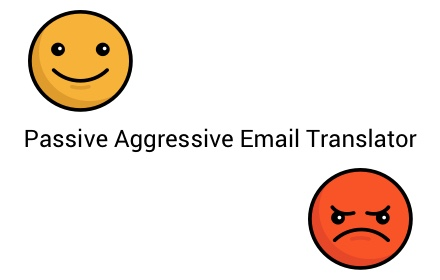
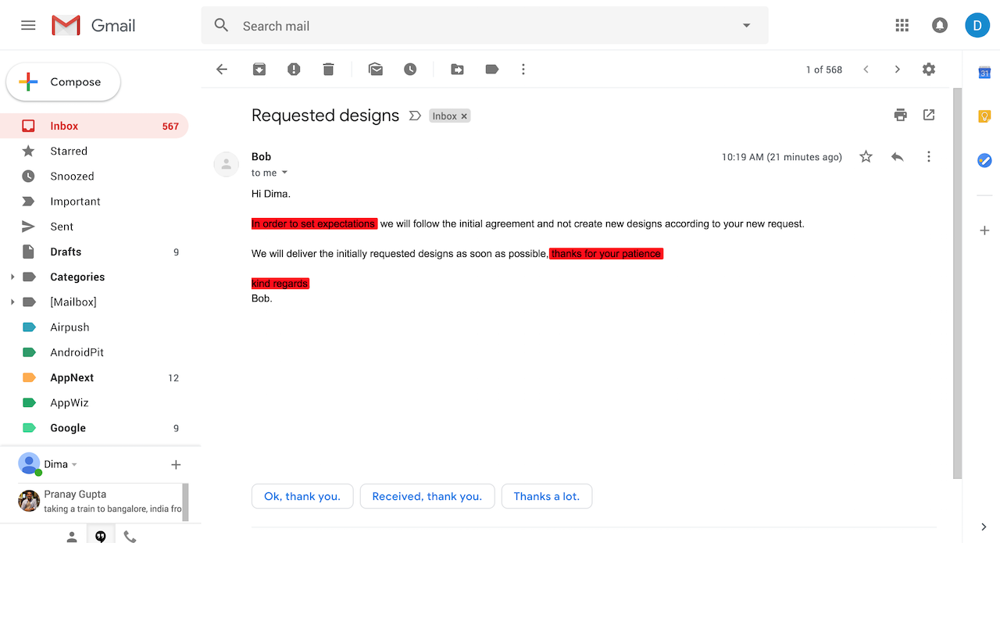
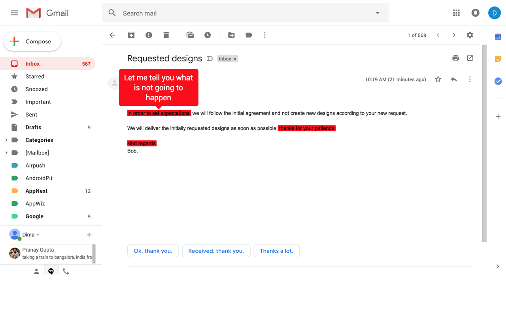

# Passive Aggressive Email Translator



This repo contains a Chrome extension that identifies and translates passive aggressive phrases in emails.
Currently works only with Gmail client.

## Try it

[Passive Aggressive Email Translator Extension](https://chrome.google.com/webstore/detail/passive-aggressive-email/ilobmjgokpmfhhhlhhdkgckmcajdogok)

### Screenshots





## For developers

First get the code and build it:

```
# get code
git clone https://github.com/dimshik100/passive-aggressive-email-translator/

# get dependencies and build
npm install
npm run build
```

Now ensure the code loads and works:

* [Load the "dist" folder containing the extension](https://developer.chrome.com/extensions/getstarted) (or `manifest.json`) in
your browser.

    1. Open the Extension Management page by navigating to chrome://extensions.
        The Extension Management page can also be opened by clicking on the Chrome menu, hovering over More Tools then selecting Extensions.
    2. Enable Developer Mode by clicking the toggle switch next to Developer mode.
    3. Click the LOAD UNPACKED button and select the extension directory.


    4. Ta-da! The extension has been successfully installed. Because no icons were included in the manifest, a generic toolbar icon will be created for the extension.


* Load `mail.google.com` in your browser and open the developer console.

You should be greeted by a message saying the following

```
Hello, <you>. This is your passive aggressive extension talking!
```

If that works, you should now be ready to customize the
extension-code. Do this by editing `extension.js`.

This extension is using [gmail.js](https://github.com/KartikTalwar/gmail.js/) library.

`gmail` should be exposed in the developer console as a global
variable.

You can use this to play around and get familiar with the API.

Cheers!


## TODO

[x] Import partial code from animate.css (only the needed animations)
    Use [animate sass](https://github.com/tgdev/animate-sass)

[x] Mark passive aggressive phrases in open emails.
    Use [mark.js](https://markjs.io/)

[x] Add a tooltip that appears when hovering over a passive aggressive phrase with the real meaning of the phrase.
    Use [tipso](https://tipso.object505.com/)

[ ] Change from browserify to webpack.
Checkout [chrome extension webpack boilerplate](https://github.com/samuelsimoes/chrome-extension-webpack-boilerplate)

[x] Create extension icon. Add source file.

[x] Change extension icon to Enabled / Disabled mode if the user is in Gmail or not.

[ ] ~~Add a badge to extension icon with the number of found passive aggressive phrases in the opened email.~~

<!-- 

TODO: 
Create a video of how the extension works.
    * Open gmail
    * change all fonts to "block" font
    * Start video capturing of the screen
    *send yourself an email from mobile, It will show up with real text
    * Open the email, a small notification should appear on it "This email may contain passive aggressive content"
    * Hover with the pointer on the marked passive aggressive phrases
    * The popup will show the real meaning of the phrase

Check if we can use brain.js to detect more passive aggressive phrases

Create a logo and an icon
(https://www.barnesandnoble.com/w/passive-aggression-martin-kantor-md/1125984078) 


// Credit the icon author
Icons made by [Freepik](https://www.flaticon.com/authors/freepik") from [www.flaticon.com]("https://www.flaticon.com/") is licensed by [CC 3.0 BY]("http://creativecommons.org/licenses/by/3.0/")


Add option to toggle the markings from the extension button.
Use $(".context").unmark(options);


Add option of animating the extension icon
https://hackernoon.com/using-pixijs-to-generate-or-animate-a-chrome-extension-icon-cad2d5ff40c9
-->